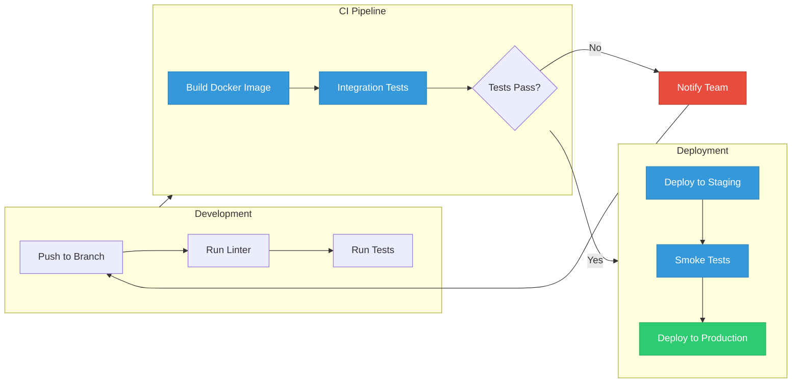
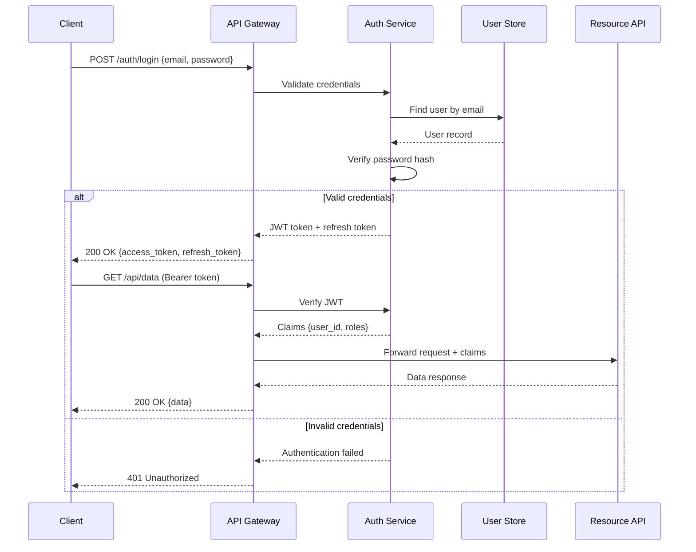
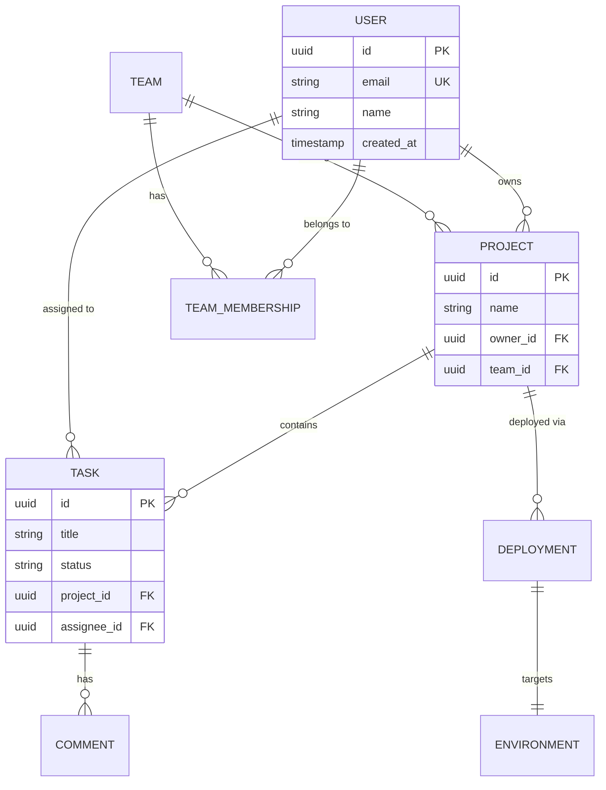
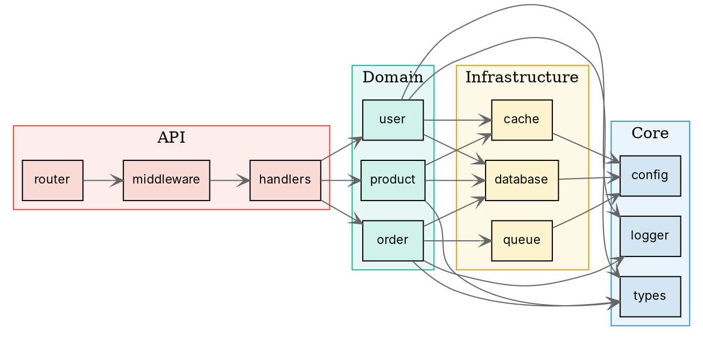
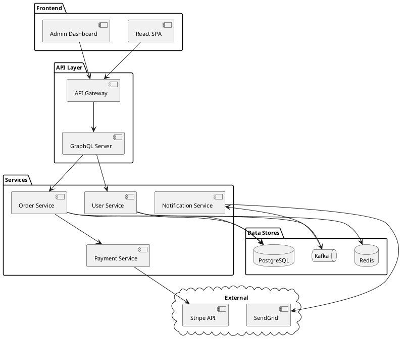
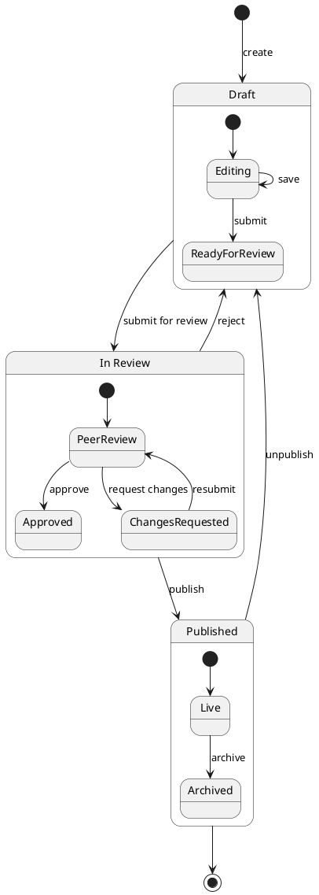

# Diagrams Skill - Examples

Open this file in a Markdown viewer that supports these renderers (e.g., the [Markdown Viewer](https://docu.md) browser extension) to see rendered output.

---

## 1. Mermaid - CI/CD Pipeline Flow



---

## 2. Mermaid - Sequence Diagram (API Authentication)



---

## 3. Mermaid - Entity Relationship Diagram



---

## 4. Graphviz - Module Dependency Graph



---

## 5. Vega-Lite - Monthly Revenue Chart

```vega-lite
{
  "$schema": "https://vega.github.io/schema/vega-lite/v5.json",
  "title": "Monthly Revenue by Product Line",
  "width": 500,
  "height": 300,
  "data": {
    "values": [
      {"month": "Jan", "revenue": 45000, "product": "SaaS"},
      {"month": "Feb", "revenue": 52000, "product": "SaaS"},
      {"month": "Mar", "revenue": 61000, "product": "SaaS"},
      {"month": "Apr", "revenue": 58000, "product": "SaaS"},
      {"month": "May", "revenue": 72000, "product": "SaaS"},
      {"month": "Jun", "revenue": 85000, "product": "SaaS"},
      {"month": "Jan", "revenue": 22000, "product": "Consulting"},
      {"month": "Feb", "revenue": 28000, "product": "Consulting"},
      {"month": "Mar", "revenue": 35000, "product": "Consulting"},
      {"month": "Apr", "revenue": 30000, "product": "Consulting"},
      {"month": "May", "revenue": 42000, "product": "Consulting"},
      {"month": "Jun", "revenue": 38000, "product": "Consulting"},
      {"month": "Jan", "revenue": 12000, "product": "Training"},
      {"month": "Feb", "revenue": 15000, "product": "Training"},
      {"month": "Mar", "revenue": 18000, "product": "Training"},
      {"month": "Apr", "revenue": 20000, "product": "Training"},
      {"month": "May", "revenue": 22000, "product": "Training"},
      {"month": "Jun", "revenue": 25000, "product": "Training"}
    ]
  },
  "mark": "bar",
  "encoding": {
    "x": {"field": "month", "type": "ordinal", "sort": ["Jan", "Feb", "Mar", "Apr", "May", "Jun"]},
    "y": {"field": "revenue", "type": "quantitative", "title": "Revenue ($)"},
    "color": {"field": "product", "type": "nominal", "title": "Product Line"},
    "tooltip": [
      {"field": "product", "type": "nominal"},
      {"field": "month", "type": "ordinal"},
      {"field": "revenue", "type": "quantitative", "format": "$,.0f"}
    ]
  }
}
```

---

## 6. Vega-Lite - Scatter Plot with Trend

```vega-lite
{
  "$schema": "https://vega.github.io/schema/vega-lite/v5.json",
  "title": "Response Time vs Request Volume",
  "width": 400,
  "height": 300,
  "data": {
    "values": [
      {"requests": 100, "latency": 12, "service": "auth"},
      {"requests": 250, "latency": 18, "service": "auth"},
      {"requests": 500, "latency": 25, "service": "auth"},
      {"requests": 800, "latency": 45, "service": "auth"},
      {"requests": 1200, "latency": 85, "service": "auth"},
      {"requests": 150, "latency": 8, "service": "api"},
      {"requests": 400, "latency": 15, "service": "api"},
      {"requests": 700, "latency": 22, "service": "api"},
      {"requests": 1000, "latency": 35, "service": "api"},
      {"requests": 1500, "latency": 52, "service": "api"},
      {"requests": 200, "latency": 30, "service": "search"},
      {"requests": 350, "latency": 55, "service": "search"},
      {"requests": 600, "latency": 95, "service": "search"},
      {"requests": 900, "latency": 150, "service": "search"},
      {"requests": 1100, "latency": 220, "service": "search"}
    ]
  },
  "mark": {"type": "point", "filled": true, "size": 80},
  "encoding": {
    "x": {"field": "requests", "type": "quantitative", "title": "Requests/sec"},
    "y": {"field": "latency", "type": "quantitative", "title": "P95 Latency (ms)"},
    "color": {"field": "service", "type": "nominal"},
    "shape": {"field": "service", "type": "nominal"}
  }
}
```

---

## 7. PlantUML - Component Architecture



---

## 8. PlantUML - State Machine



---

## 9. Infographic - Product Roadmap

```infographic
infographic sequence-roadmap-vertical-simple
data
  title 2026 Product Roadmap
  items
    - label Q1 2026
      desc Core platform rewrite with TypeScript strict mode. Migration to event-driven architecture.
      icon mdi/rocket-launch
    - label Q2 2026
      desc Real-time collaboration features. WebSocket integration and conflict resolution.
      icon mdi/account-group
    - label Q3 2026
      desc AI-powered code review assistant. Integration with GitHub and GitLab.
      icon mdi/brain
    - label Q4 2026
      desc Enterprise SSO, audit logging, and compliance certifications.
      icon mdi/shield-check
```

---

## 10. Infographic - KPI Dashboard

```infographic
infographic list-grid-badge-card
data
  title Platform Health - April 2026
  desc Real-time system metrics
  items
    - label Uptime
      desc 99.97% | 13 min downtime
      icon mdi/server
    - label Avg Latency
      desc 42ms | P99: 180ms
      icon mdi/speedometer
    - label Active Users
      desc 24,831 | Peak: 31K
      icon mdi/account-multiple
    - label Error Rate
      desc 0.03% | Down from 0.12%
      icon mdi/alert-circle
    - label Deployments
      desc 47 this month | 0 rollbacks
      icon mdi/rocket
    - label Test Coverage
      desc 94.2% | +2.1% MoM
      icon mdi/check-decagram
```

---

## 11. Infographic - Tech Stack Comparison

```infographic
infographic compare-binary-horizontal-underline-text-vs
data
  title Monolith vs Microservices
  items
    - label Monolith
      children
        - label Simplicity
          desc Single deployment unit, easier debugging
        - label Performance
          desc No network overhead between modules
        - label Consistency
          desc Shared database, ACID transactions
        - label Team Size
          desc Best for small teams (2-8 devs)
    - label Microservices
      children
        - label Scalability
          desc Scale individual services independently
        - label Resilience
          desc Failure isolation between services
        - label Flexibility
          desc Different tech stacks per service
        - label Team Size
          desc Best for large orgs (20+ devs)
```

---

## 12. Infographic - Sales Funnel

```infographic
infographic sequence-filter-mesh-simple
data
  title Developer Adoption Funnel
  items
    - label Visitors
      value 50000
      desc Monthly docs page views
    - label Sign-ups
      value 8500
      desc Free tier registrations (17%)
    - label Active Users
      value 3200
      desc Made 10+ API calls (38%)
    - label Paying
      value 640
      desc Converted to paid plan (20%)
    - label Enterprise
      value 48
      desc Annual contracts signed (7.5%)
```

---

## 13. Architecture Diagram - Microservices Platform (Steel Blue)

<div style="width: 1200px; box-sizing: border-box; position: relative;">
  <style scoped>
    .arch-title { text-align: center; font-size: 20px; font-weight: 600; color: #2c3e50; margin-bottom: 16px; }
    .arch-layer { margin: 10px 0; padding: 14px; border-radius: 4px; }
    .arch-layer-title { font-size: 12px; font-weight: 600; color: #34618d; margin-bottom: 10px; text-align: center; text-transform: uppercase; letter-spacing: 0.5px; }
    .arch-grid { display: grid; gap: 6px; }
    .arch-grid-2 { grid-template-columns: repeat(2, 1fr); }
    .arch-grid-3 { grid-template-columns: repeat(3, 1fr); }
    .arch-grid-4 { grid-template-columns: repeat(4, 1fr); }
    .arch-box { border-radius: 3px; padding: 8px; text-align: center; font-size: 11px; font-weight: 500; background: #e8eff5; border: 1px solid #b4cae0; color: #2c3e50; }
  </style>
  <div>
    <div class="arch-title">Event-Driven Microservices Platform</div>
    <div class="arch-layer" style="background: #dce6f0; border: 1px solid #b4cae0;">
      <div class="arch-layer-title">Client Layer</div>
      <div class="arch-grid arch-grid-4">
        <div class="arch-box">React SPA</div>
        <div class="arch-box">Mobile (React Native)</div>
        <div class="arch-box">Admin Dashboard</div>
        <div class="arch-box">CLI Tool</div>
      </div>
    </div>
    <div class="arch-layer" style="background: #c8d8e8; border: 1px solid #a0bcd4;">
      <div class="arch-layer-title">API Gateway & Edge</div>
      <div class="arch-grid arch-grid-3">
        <div class="arch-box">Kong Gateway</div>
        <div class="arch-box">Rate Limiter</div>
        <div class="arch-box">Auth (JWT + OAuth2)</div>
      </div>
    </div>
    <div class="arch-layer" style="background: #b4cae0; border: 1px solid #8caec8;">
      <div class="arch-layer-title">Domain Services</div>
      <div class="arch-grid arch-grid-4">
        <div class="arch-box">User Service</div>
        <div class="arch-box">Order Service</div>
        <div class="arch-box">Inventory Service</div>
        <div class="arch-box">Payment Service</div>
      </div>
    </div>
    <div class="arch-layer" style="background: #a0bcd4; border: 1px solid #78a0bc;">
      <div class="arch-layer-title">Event Bus & Messaging</div>
      <div class="arch-grid arch-grid-3">
        <div class="arch-box">Apache Kafka</div>
        <div class="arch-box">Schema Registry</div>
        <div class="arch-box">Dead Letter Queue</div>
      </div>
    </div>
    <div class="arch-layer" style="background: #8caec8; border: 1px solid #6492b0;">
      <div class="arch-layer-title">Data Layer</div>
      <div class="arch-grid arch-grid-4">
        <div class="arch-box">PostgreSQL (Users)</div>
        <div class="arch-box">PostgreSQL (Orders)</div>
        <div class="arch-box">Redis Cache</div>
        <div class="arch-box">S3 (Documents)</div>
      </div>
    </div>
    <div class="arch-layer" style="background: #78a0bc; border: 1px solid #5a88a4;">
      <div class="arch-layer-title">Observability</div>
      <div class="arch-grid arch-grid-3">
        <div class="arch-box">Grafana + Prometheus</div>
        <div class="arch-box">OpenTelemetry</div>
        <div class="arch-box">PagerDuty Alerts</div>
      </div>
    </div>
  </div>
</div>

---

## 14. Infocard - Tech Blueprint Style

<div style="max-width: 800px; box-sizing: border-box; position: relative;">
  <style scoped>
    .card { position: relative; background: #0a1628; padding: 40px; overflow: hidden; font-family: 'Inter', 'Noto Sans SC', sans-serif; color: #c8d8ea; line-height: 1.6; }
    .card::before { content: ''; position: absolute; inset: 0; pointer-events: none; opacity: 0.08; background-image: linear-gradient(rgba(0,212,255,0.5) 1px, transparent 1px), linear-gradient(90deg, rgba(0,212,255,0.5) 1px, transparent 1px); background-size: 24px 24px; }
    .card-meta { margin: 0 0 12px; font-size: 12px; font-weight: 700; letter-spacing: 0.18em; text-transform: uppercase; color: #5a7a96; font-family: 'SF Mono', 'Fira Code', monospace; }
    .card-title { margin: 0 0 16px; font-size: 34px; font-weight: 700; line-height: 1.2; letter-spacing: -0.01em; color: #00d4ff; }
    .card-bar { width: 80px; height: 3px; margin: 0 0 20px; background: #00d4ff; box-shadow: 0 0 8px rgba(0,212,255,0.3); }
    .card-body { margin: 0 0 16px; font-size: 15px; line-height: 1.6; color: #c8d8ea; }
    .card-grid { display: grid; gap: 16px; }
    .card-grid-2 { grid-template-columns: 1.1fr 0.9fr; }
    .card-grid-3 { grid-template-columns: repeat(3, 1fr); }
    .card-panel { padding: 16px 18px; background: rgba(0,212,255,0.06); border-top: 3px solid #00d4ff; border-left: 1px solid rgba(0,212,255,0.15); }
    .card-panel-title { margin: 0 0 8px; font-size: 12px; font-weight: 700; letter-spacing: 0.12em; text-transform: uppercase; color: #00d4ff; font-family: 'SF Mono', 'Fira Code', monospace; }
    .card-panel-text { margin: 0; font-size: 14px; line-height: 1.55; color: #8ab0cc; }
    .card-stat { font-family: 'SF Mono', 'Fira Code', monospace; font-size: 44px; font-weight: 700; line-height: 1; color: #00d4ff; margin: 0; text-shadow: 0 0 12px rgba(0,212,255,0.25); }
    .card-stat-label { font-size: 12px; font-weight: 600; color: #5a7a96; text-transform: uppercase; letter-spacing: 0.1em; margin: 4px 0 0; font-family: 'SF Mono', 'Fira Code', monospace; }
    .card-highlight { font-size: 17px; font-weight: 500; line-height: 1.5; color: #c8d8ea; padding: 10px 0 10px 18px; border-left: 3px solid #00d4ff; margin: 16px 0; }
    .card-footer { margin-top: 20px; padding-top: 12px; border-top: 1px solid rgba(0,212,255,0.15); font-size: 11px; color: #5a7a96; letter-spacing: 0.05em; font-family: 'SF Mono', 'Fira Code', monospace; }
  </style>
  <div class="card">
    <p class="card-meta">SPEC // Database Migration</p>
    <h1 class="card-title">PostgreSQL 16 Upgrade<br>Migration Runbook</h1>
    <div class="card-bar"></div>
    <p class="card-body">Zero-downtime migration from PostgreSQL 14 to 16 using logical replication. The migration window targets off-peak hours with automated rollback triggers if replication lag exceeds thresholds.</p>
    <p class="card-highlight">Target: &lt; 30 seconds of read-only mode during cutover</p>
    <div class="card-grid card-grid-3">
      <div style="text-align: center; padding: 12px 0;">
        <p class="card-stat">2.4TB</p>
        <p class="card-stat-label">Database Size</p>
      </div>
      <div style="text-align: center; padding: 12px 0;">
        <p class="card-stat">847</p>
        <p class="card-stat-label">Tables</p>
      </div>
      <div style="text-align: center; padding: 12px 0;">
        <p class="card-stat">~30s</p>
        <p class="card-stat-label">Cutover Time</p>
      </div>
    </div>
    <div class="card-grid card-grid-2" style="margin-top: 16px;">
      <div class="card-panel">
        <p class="card-panel-title">PREREQUISITES</p>
        <p class="card-panel-text">pg_logical installed on source. Target provisioned with 3x IOPS. Replication slots created. Application connection pool configured for switchover.</p>
      </div>
      <div class="card-panel">
        <p class="card-panel-title">ROLLBACK TRIGGERS</p>
        <p class="card-panel-text">Replication lag > 5s. Error rate > 0.1%. Connection pool exhaustion. Any failed health check on target within first 15 minutes.</p>
      </div>
    </div>
    <div class="card-footer">REV 2.1 // Database Engineering // April 2026</div>
  </div>
</div>

---

## 15. Infocard - Editorial Warm Style

<div style="max-width: 800px; box-sizing: border-box; position: relative;">
  <style scoped>
    .card { position: relative; background: #f5f3ed; padding: 40px; overflow: hidden; font-family: 'Inter', 'Noto Sans SC', sans-serif; color: #111; line-height: 1.6; }
    .card::before { content: ''; position: absolute; inset: 0; pointer-events: none; opacity: 0.04; background-image: radial-gradient(circle at 20% 20%, rgba(0,0,0,0.8) 0.5px, transparent 0.8px), radial-gradient(circle at 80% 40%, rgba(0,0,0,0.7) 0.4px, transparent 0.7px); background-size: 8px 8px, 11px 11px; }
    .card-meta { margin: 0 0 12px; font-size: 12px; font-weight: 700; letter-spacing: 0.15em; text-transform: uppercase; color: #575757; }
    .card-title { margin: 0 0 16px; font-family: 'Noto Serif SC', serif; font-size: 36px; font-weight: 900; line-height: 1.15; letter-spacing: -0.02em; color: #111; }
    .card-bar { width: 80px; height: 6px; margin: 0 0 20px; background: #111; }
    .card-body { margin: 0 0 16px; font-size: 15px; line-height: 1.6; color: #111; }
    .card-grid { display: grid; gap: 16px; }
    .card-grid-2 { grid-template-columns: 1.1fr 0.9fr; }
    .card-panel { padding: 16px 18px; background: rgba(0,0,0,0.03); border-top: 6px solid #111; }
    .card-panel-title { margin: 0 0 8px; font-size: 12px; font-weight: 700; letter-spacing: 0.12em; text-transform: uppercase; color: #575757; }
    .card-panel-text { margin: 0; font-size: 14px; line-height: 1.55; color: #333; }
    .card-highlight { font-size: 17px; font-weight: 500; line-height: 1.5; color: #111; padding: 10px 0 10px 18px; border-left: 3px solid #111; margin: 16px 0; }
    .card-body.dropcap::first-letter { font: 900 72px/0.82 'Noto Serif SC', Georgia, serif; float: left; margin: 4px 12px 0 -2px; color: #111; }
    .card-endmark { display: block; text-align: right; font-size: 14px; color: #111; opacity: 0.3; margin-top: 20px; }
    .card-footer { margin-top: 20px; padding-top: 12px; border-top: 1px solid rgba(0,0,0,0.1); font-size: 11px; color: #575757; letter-spacing: 0.05em; }
  </style>
  <div class="card">
    <p class="card-meta">Engineering Culture · Incident Review</p>
    <h1 class="card-title">What We Learned From<br>Our Worst Outage</h1>
    <div class="card-bar"></div>
    <p class="card-body dropcap">On March 14th, a routine database migration took down our entire platform for 47 minutes during peak hours. The root cause wasn't the migration itself -- it was the cascade of retry storms from 200+ microservices that turned a 3-second blip into a sustained outage. Every service tried to reconnect simultaneously, overwhelming connection pools and creating a thundering herd that took longer to resolve than the original issue.</p>
    <p class="card-highlight">The retry storm caused 10x more damage than the original failure</p>
    <div class="card-grid card-grid-2">
      <div class="card-panel">
        <p class="card-panel-title">What Changed</p>
        <p class="card-panel-text">Every service now implements exponential backoff with jitter. Circuit breakers trip after 3 consecutive failures. Connection pools have hard limits with graceful degradation. We run chaos engineering exercises monthly.</p>
      </div>
      <div class="card-panel">
        <p class="card-panel-title">Key Lesson</p>
        <p class="card-panel-text">Resilience isn't about preventing failures -- it's about controlling the blast radius when they happen. A system that fails gracefully under pressure is more valuable than one that works perfectly until it doesn't.</p>
      </div>
    </div>
    <span class="card-endmark">&#8718;</span>
    <div class="card-footer">Incident Retrospective IR-2026-047 · Engineering Blog · April 2026</div>
  </div>
</div>

