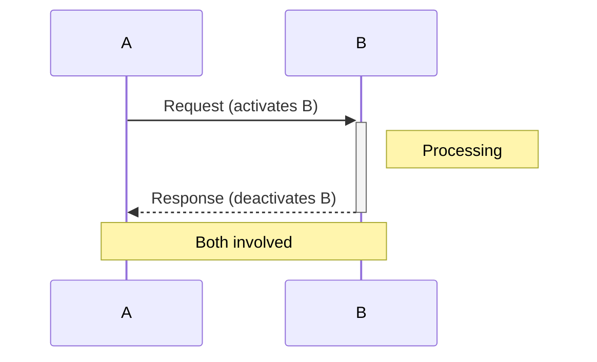
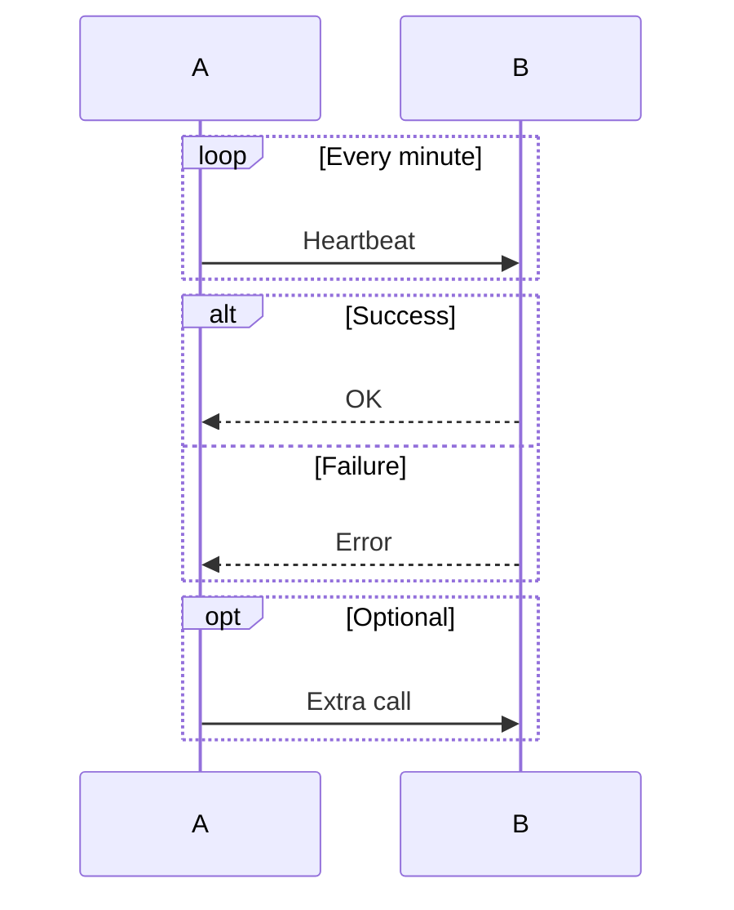
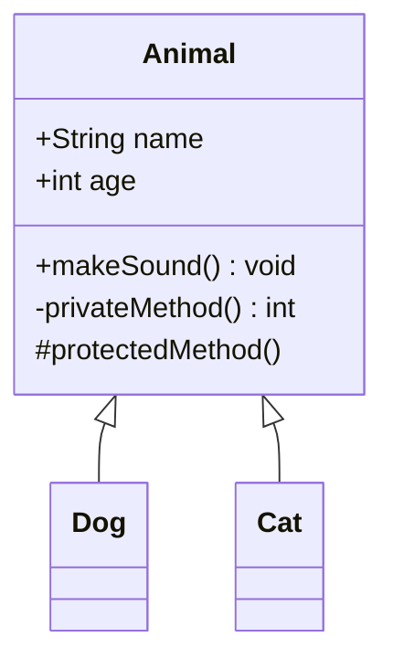
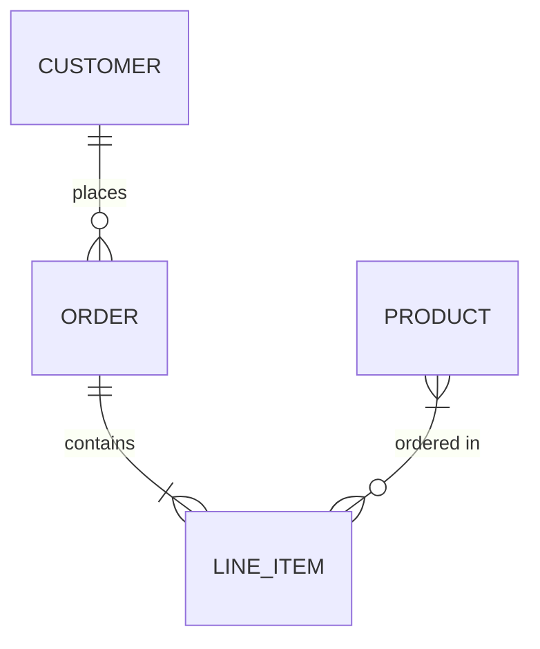
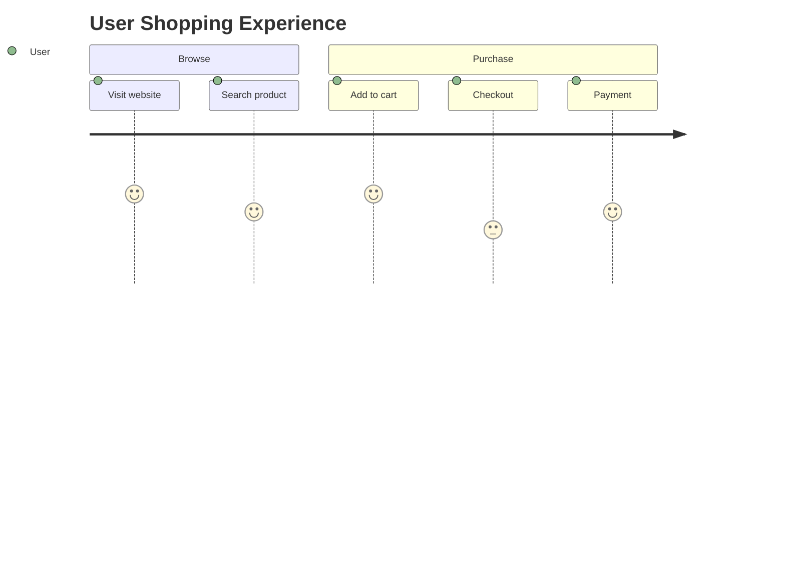
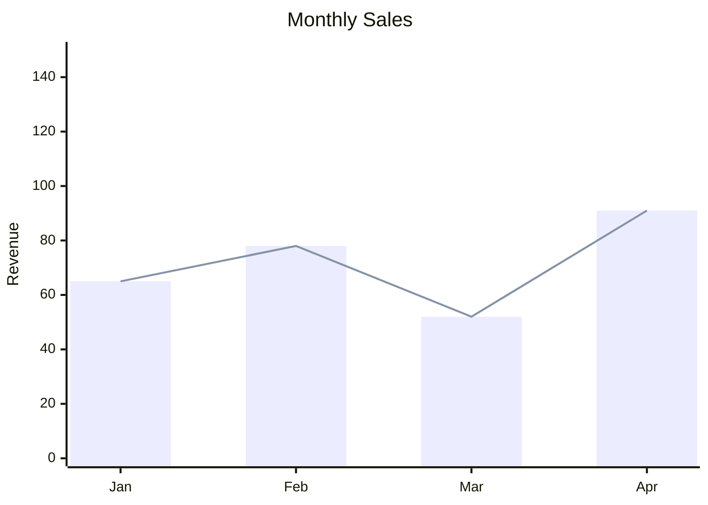
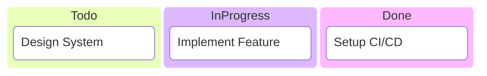
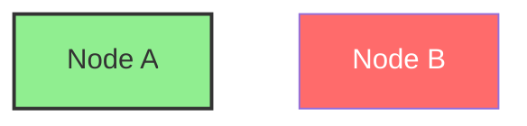
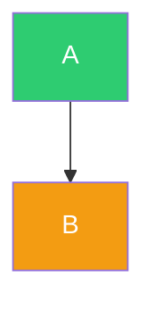
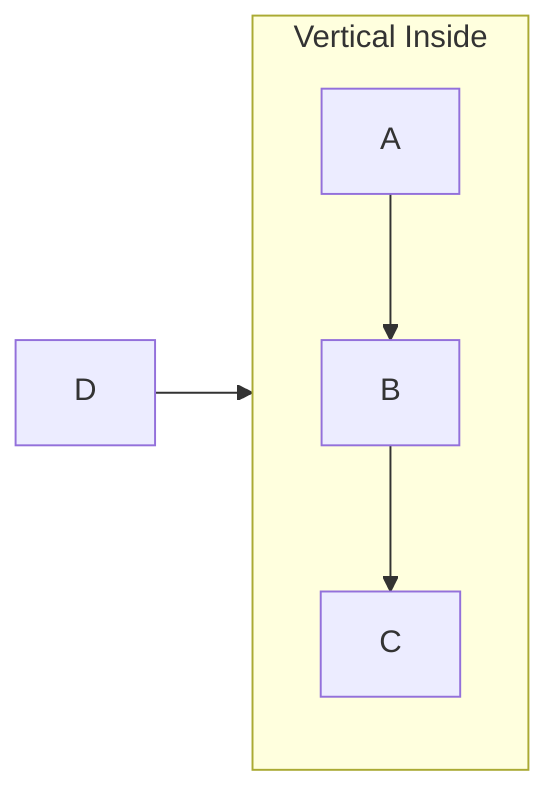

# Mermaid Diagram Reference

Create flowcharts, sequence diagrams, state machines, class diagrams, Gantt charts, and mindmaps using text-based syntax.

**Code fence:** ` ```mermaid `

## Critical Syntax Rules

### Rule 1: List Syntax Conflicts
```
[1.Item]      -- Remove space after period
[① Item]      -- Use circled numbers ①②③④⑤⑥⑦⑧⑨⑩
[(1) Item]    -- Use parentheses
```
Never use `[1. Item]` (space after period) -- causes "Unsupported markdown: list" error.

### Rule 2: Subgraph Naming
```
subgraph agent["AI Agent Core"]  -- ID with display name
subgraph agent                   -- Simple ID only
```
Never use `subgraph AI Agent Core` (space without quotes).

### Rule 3: Node References in Subgraphs
Reference subgraph **ID**, not display name:
```
Title --> agent    -- correct (uses ID)
```

### Rule 4: Special Characters in Node Text
```
["Text with spaces"]       -- Quotes for spaces
Use #quot; instead of "    -- Avoid quotation marks
Use #lpar;#rpar; for ()    -- Avoid parentheses
```

### Rule 5: Use flowchart over graph
```
flowchart TD  -- correct (supports subgraph directions, more features)
```

## Common Pitfalls

| Issue | Solution |
|-------|----------|
| Diagram won't render | Check unmatched brackets, quotes |
| List syntax error | `[1.Item]` not `[1. Item]` |
| Subgraph reference fails | Use ID not display name |
| Too crowded | Split into multiple diagrams |
| Crossing connections | Use different layout direction or invisible edges `~~~` |

---

## Sequence Diagram Syntax

### Messages
```
->>   Solid line with arrow
-->>  Dashed line with arrow
-)    Solid line with open arrow
--)   Dashed line with open arrow
```

### Activation & Notes


### Loops & Conditions


---

## Class Diagram Syntax

### Relationships
```
<|--  Inheritance
*--   Composition
o--   Aggregation
-->   Association
--    Link (solid)
..>   Dependency
..|>  Realization
```

### Class Definition


---

## ER Diagram Syntax

### Cardinality
```
||--||  One to one
||--o{  One to many
}o--o{  Many to many
||--o|  One to zero or one
```

### Example


---

---

## User Journey Syntax



Score: 1 (bad) to 5 (great)

---

## XY Chart Syntax



---

## Kanban Syntax



---

## Layout & Styling

### Directions
- `TB` / `TD` -- Top to Bottom (default)
- `LR` -- Left to Right
- `RL` -- Right to Left
- `BT` -- Bottom to Top

### Node Styling


### Class Definitions


### Subgraph Nesting & Direction

