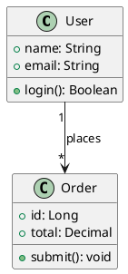
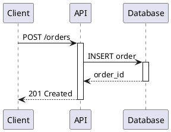
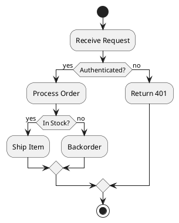
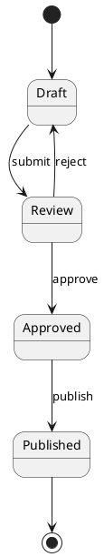
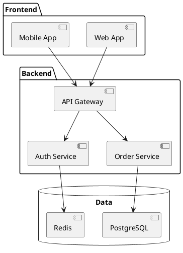
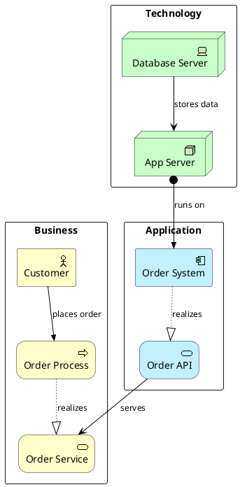

# PlantUML Diagram Reference

Create UML diagrams, cloud architecture, network topology, security diagrams, enterprise architecture, and more using PlantUML syntax with 9,500+ mxgraph stencil icons.

**Code fence:** ` ```plantuml ` or ` ```puml ` (never ` ```text `)

## Critical Syntax Rules

1. Every diagram starts with `@startuml` and ends with `@enduml`
2. Always use ` ```plantuml ` or ` ```puml ` code fence
3. Use `left to right direction` for typical data flows
4. Stencil syntax: `mxgraph.<namespace>.<icon> "Label" as <alias>`
5. Default styling applies automatically -- don't manually specify colors for stencil icons

## Connection Types

| Syntax | Meaning |
|--------|---------|
| `-->` | Solid arrow (synchronous flow, direct access) |
| `..>` | Dashed arrow (async events, audit, detection) |
| `--` | Plain line (bidirectional link) |
| `-->` with label | `A --> B : "label"` |

---

## UML Diagrams

### Supported Types
Class, Sequence, Activity, State Machine, Component, Use Case, Deployment, Object, Package, Timing, Composite Structure, Profile, Interaction Overview, Communication

### Class Diagram


### Sequence Diagram


### Activity Diagram


### State Machine


### Component Diagram


### Relationship Arrows
```
-->    Association
<|--   Inheritance
*--    Composition
o--    Aggregation
..>    Dependency
..|>   Realization
```

### Styling
```plantuml
@startuml
skinparam backgroundColor white
skinparam defaultFontSize 12
skinparam classBorderColor #333
skinparam classBackgroundColor #f8f8f8
@enduml
```

---

## Cloud Architecture

### Stencil Prefixes

| Provider | Prefix | Examples |
|----------|--------|----------|
| AWS | `mxgraph.aws4.*` | `lambda_function`, `ec2`, `s3`, `api_gateway`, `dynamodb`, `sqs`, `sns`, `cloudfront`, `rds`, `ecs` |
| Azure | `mxgraph.azure.*` | `virtual_machine`, `app_service`, `sql_database`, `storage_blob`, `functions` |
| GCP | `mxgraph.gcp2.*` | `compute_engine`, `cloud_functions`, `cloud_storage`, `bigquery`, `pub_sub` |
| Kubernetes | `mxgraph.kubernetes2.*` | `pod`, `service`, `deployment`, `ingress`, `config_map` |
| Alibaba | `mxgraph.alibaba_cloud.*` | `ecs`, `oss`, `rds`, `slb` |
| IBM | `mxgraph.ibm_cloud.*` | `kubernetes_service`, `cloud_functions` |

### AWS Example
```plantuml
@startuml
left to right direction

mxgraph.aws4.api_gateway "API Gateway" as apigw
mxgraph.aws4.lambda_function "Order Lambda" as lambda
mxgraph.aws4.dynamodb "Orders Table" as dynamo
mxgraph.aws4.sqs "Order Queue" as sqs
mxgraph.aws4.sns "Notifications" as sns

apigw --> lambda
lambda --> dynamo
lambda --> sqs
sqs ..> sns
@enduml
```

---

## Network Topology

### Stencil Families

| Family | Prefix | Use For |
|--------|--------|---------|
| Basic Network | `mxgraph.networks.*` | Switches, routers, firewalls |
| Cisco | `mxgraph.cisco.*` | Enterprise Cisco equipment |
| Cisco 19 | `mxgraph.cisco19.*` | Modern Cisco icons |
| Cisco SAFE | `mxgraph.cisco_safe.*` | Security icons |
| Citrix | `mxgraph.citrix.*` | Virtual infrastructure |

### Connection Types for Networks
| Syntax | Meaning |
|--------|---------|
| `--` | Physical connection |
| `-->` | Directed flow |
| `..` | VPN/wireless link |
| `..>` | Logical flow |

### Diagram Types
LAN, WAN, Enterprise, Wireless, Cloud-Hybrid, Citrix, Security, Data Center, Monitoring

---

## Security Architecture

### Stencil Categories

| Domain | Key Stencils |
|--------|-------------|
| Identity & Access | IAM roles, SSO, directory services, STS |
| Encryption | Key management, secrets rotation, HSM, certificates |
| Network Security | Firewalls, WAF, DDoS protection, security groups |
| Threat Detection | GuardDuty, Detective, Inspector |
| Compliance | CloudTrail, audit managers, compliance frameworks |
| Data Protection | Sensitive data discovery, classification |

### Patterns
IAM authentication, encryption pipelines, network defense, threat response, compliance auditing, zero-trust, data classification, multi-account governance

---

## Enterprise Architecture (ArchiMate)

Requires: `!include <archimate/Archimate>`

### Element Macros by Layer

| Layer | Macros |
|-------|--------|
| Business | `Business_Actor`, `Business_Role`, `Business_Process`, `Business_Function`, `Business_Service`, `Business_Event`, `Business_Object` |
| Application | `Application_Component`, `Application_Service`, `Application_Function`, `Application_Interface`, `Application_DataObject` |
| Technology | `Technology_Device`, `Technology_Node`, `Technology_SystemSoftware`, `Technology_Artifact`, `Technology_CommunicationNetwork` |
| Motivation | `Motivation_Stakeholder`, `Motivation_Driver`, `Motivation_Goal`, `Motivation_Requirement` |
| Strategy | `Strategy_Capability`, `Strategy_Resource`, `Strategy_ValueStream` |
| Implementation | `Implementation_WorkPackage`, `Implementation_Deliverable`, `Implementation_Plateau`, `Implementation_Gap` |

### Relationship Macros
All support directional suffixes: `_Up`, `_Down`, `_Left`, `_Right`

| Macro | Relationship |
|-------|-------------|
| `Rel_Composition` | Composition (solid + filled diamond) |
| `Rel_Aggregation` | Aggregation (solid + open diamond) |
| `Rel_Assignment` | Assignment (solid + circle-triangle) |
| `Rel_Realization` | Realization (dotted + hollow triangle) |
| `Rel_Serving` | Serving (solid + arrow) |
| `Rel_Triggering` | Triggering (solid + filled triangle) |
| `Rel_Flow` | Flow (dashed + filled triangle) |
| `Rel_Access` | Access (dotted line) |
| `Rel_Access_r` | Access read (dotted + arrow) |
| `Rel_Access_w` | Access write (dotted + reverse arrow) |

### ArchiMate Example


---

## BPMN (Business Process)

### Stencil Families

| Family | Prefix | Use For |
|--------|--------|---------|
| BPMN | `mxgraph.bpmn.*` | Events, gateways, tasks, data objects |
| EIP | `mxgraph.eip.*` | Enterprise Integration Patterns (routing, transformation) |
| Lean Mapping | `mxgraph.lean_mapping.*` | Value stream symbols, kanban |

### Connection Types
- `-->` Sequence flow
- `..>` Message flow (across pools)

### Patterns
Order processing, approval workflows, EIP messaging, ETL pipelines, value streams, microservice orchestration, event-driven architectures

---

## Data Analytics

### Key Stencils

| Category | Examples |
|----------|----------|
| Analytics & ETL | `athena`, `glue`, `kinesis`, `emr`, `redshift`, `opensearch`, `quicksight`, `lake_formation` |
| Databases | `aurora`, `rds`, `dynamodb`, `neptune`, `elasticache`, `documentdb` |

### Connection Types
- `-->` Batch flows
- `..>` Streaming/async

### Patterns
Data lake, real-time streaming, data warehouse, ETL workflow, log analytics, ML feature store, CDC pipeline, multi-source BI

---

## IoT

### Key Stencils
`iot_core`, `greengrass`, `sensor`, `thermostat`, `camera`, `factory`, `iot_thing_plc`, `iot_fleetwise`

### Patterns
Smart factory, smart home, fleet telemetry, edge computing, digital twins, sensor networks, device management, robotics
