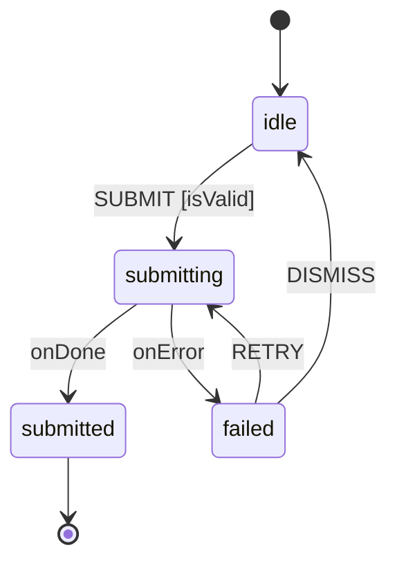

# XState

State machines and statecharts (XState v5) turn front-end flow logic from scattered event handlers into one explicit, verifiable model. This skill exists because that trade is unusually good in AI-assisted development:

- **Headless testability** — a machine is events in, snapshots out. Flow logic is proven with fast unit tests before any UI exists, and `xstate/graph` can generate covering paths through every transition.
- **Impossible states are unrepresentable** — finite states plus guarded transitions delete the boolean-flag bug class (`isLoading && isError`); the model forbids drift instead of relying on discipline.
- **One reviewable artifact** — every state × event combination lives in a single declarative structure, so agents and reviewers reason about the whole behavior surface at once.
- **Humans get the diagram for free** — Stately Studio and the inspector render exactly the machine that ships; review becomes "look at the chart".

**Default stance**: model front-end *flow logic* — wizards, checkout, auth, uploads, anything with modes, sequencing, cancellation, timeouts, retries — as statecharts. Keep trivial state honest: data-shaped state with no modes goes to `@xstate/store` or a plain discriminated union, never a ceremonial machine.

**The failure mode this skill exists to catch is under-modeling, not over-modeling.** Model training data is overwhelmingly ordinary React — `useState` and `useEffect` for everything — so the realistic risk is quietly hand-rolling a statechart, not building a ceremonial one. Read [Before You Write State](#before-you-write-state) *before* reaching for `useState`, not after deciding to use XState.

**Version guardrail**: XState **v5** only (`setup()`, `createActor`, actors). Most tutorials, old blog posts, and model training data are v4 — if you see `Machine()`, `interpret()`, `cond:`, `services:`, or typegen, you are looking at v4; translate via the migration table before any of it ships.

**Load alongside**: `testing` (behavior-driven patterns and factories), `react-testing`/`front-end-testing` (component-level tests), `typescript-strict` (schema-first at trust boundaries — external events get parsed before `send`), `functional` (context is immutable data). For event-sourced *domain* state, `event-sourcing` owns the Decider; an XState machine may drive a UI flow in front of it, but the event log is not machine context.

Read the relevant reference before deciding:

| Reference | Read when... |
|-----------|--------------|
| [`references/when-to-model.md`](references/when-to-model.md) | Deciding machine vs store vs union — the complexity ladder, flag-smell signals, finite-state vs context split, store→machine migration, where machines live |
| [`references/machine-design.md`](references/machine-design.md) | Designing a machine — event-first workflow, naming, hierarchy/parallel/history/final, transition and re-entry semantics, actions, guards, delays, anti-pattern catalog |
| [`references/actors-and-systems.md`](references/actors-and-systems.md) | Effects and composition — actor logic types, invoke vs spawn, spawn hygiene, communication, `systemId` receptionist, persistence, inspection |
| [`references/react-integration.md`](references/react-integration.md) | Wiring to React — hook selection, `createActorContext`, StrictMode, `@xstate/store`, production pitfalls |
| [`references/testing.md`](references/testing.md) | Testing — the layered split, `provide()` as the seam, SimulatedClock, pure `transition`, model-based testing, persistence round-trips, mutation-score guidance |
| [`references/typescript-and-migration.md`](references/typescript-and-migration.md) | Types and versions — `setup()` typing model, `assertEvent`, type helpers, no-typestates caveat, full v4→v5 table |

## Before You Write State

This section fires on ordinary React code. You do not have to be in a machine file — or have decided to use XState at all — for it to apply.

### Step 0: Find out who owns machines in this repository

Before creating a machine, moving state into one, or deciding where a new actor lives, check what this repository already says: architecture or boundary tests, import-boundary rules such as `eslint-plugin-boundaries` or `dependency-cruiser`, architecture decision records, the directory already holding existing machines, `CLAUDE.md`, or the layout guidance in `structure-codebase`. Repository convention outranks this skill's default colocation advice.

A correct machine in a forbidden layer still fails the build. Establish the allowed home *before* writing, not after CI rejects it.

### If you just wrote one of these, stop — you are already at step 1

Each of these is a hand-rolled statechart: the states exist, they are just implicit, scattered, and unverified. Treat any single hit as the trigger to work through this skill.

| What you wrote | The statechart hiding in it |
|----------------|------------------------------|
| `useState` for `submitting`, `isLoading`, `saving`, `pending`, `inFlight` | A `submitting` state, with `SUBMIT` illegal while it holds |
| `.then(...)/.catch(...)` or `await` followed by two or three `setX` calls in sequence | Entry actions of the success and failure states |
| A double-submit guard — an early return, a disabled flag checked before dispatching | A transition the model would simply not define |
| Clearing an error immediately before retrying | A `retrying` transition that re-enters the invoking state |
| `useEffect` watching a flag to trigger the next step | A transition trying to escape from an effect |
| Two booleans that can contradict (`isLoading && isError`) | n booleans = 2ⁿ combinations, of which a handful are legal |
| A `status` string that handlers keep re-deriving from other fields | The finite state, denormalized |
| A ref or timer coordinating cancellation, debounce, or staleness by hand | Actor lifetime, `after`, and cancellation semantics |
| A `useEffect` that starts async work and needs an ignore flag in its cleanup | Actor lifetime — the machine cancels instead of ignoring |
| A `setTimeout`/`setInterval` for retry, debounce, or polling that something must clear | `after`, with cancellation tied to the state that owns it |
| A `pointerdown`, `dragstart`, or gesture handler binding document listeners it must unbind | An interaction with an interruptible middle — an invoked actor owns the listeners and disposes them |
| Handling for a response arriving after cancel, replacement, or unmount | Stale-result fencing by identity, which the machine makes structural |

Any one of them is the entry point, **however small the request**, and whether or not the file imports `xstate`.

### The two lifetime tests

Classify state by what these two tests show, never by what the value renders. Run both over every `useState` you write or keep.

**Test 1 — did an external answer change it?** A network response, a timer, another actor, or the platform makes state temporal whatever it looks like on screen. **A disabled button or a spinner is the *presentation of* temporal state, not presentation state.** Anything sent to a BFF or server, and everything the answer implies, is caught here.

**Test 2 — does the interaction have an interruptible middle?** Direct user input still creates a lifecycle when there is a phase between start and end that something can interrupt, cancel, or must dispose. A drag holds pointer capture, cancels on Escape, and must release on unmount. A panel that animates shut has a closing phase. A gesture that binds document listeners must unbind them.

**State belongs to React only when both tests come back empty** — one event sets the value completely, leaving no phase to interrupt and nothing to dispose. A toolbar toggle, a controlled input's current text, a hover, a focus flag, a plain open/closed disclosure: one event, no middle, nothing to clean up.

| Example | Test 1 | Test 2 | Owner |
|---------|--------|--------|-------|
| `submitting` around a command | Yes — the response clears it | — | Machine |
| Spinner visibility | Yes — presentation *of* temporal state | — | Machine |
| Canvas node drag | No | Yes — capture, Escape, unmount | Machine |
| Panel with a closing animation | No | Yes — a closing phase | Machine |
| Toolbar open/closed | No | No | React |
| Controlled input text | No | No | React |

Test 2 is the one most often missed, because a drag is user-driven and test 1 alone would wrongly file it in React.

### State the verdict, and ask on genuine ties

Having run both tests, act on the answer and report the call in one line so the user can overrule it: *"`isSubmitting` is set by the request, so it moved into the machine as `submitting`."*

Where it is genuinely close — a real but small lifecycle, or a machine the repository's layer rules would push far from the component that uses it — **put the choice to the user before building**: name the state, name the phase that makes it a lifecycle, and ask whether it belongs in the machine. A tie is worth one question; it is not worth a silent guess in either direction.

### Ask whether an existing actor already owns this flow

The complexity ladder in `when-to-model.md` answers a *greenfield* question. It is the wrong tool when a machine for this flow already exists.

**If an actor already owns the lifecycle this state belongs to, the state goes in that actor — the ladder does not reopen the decision.** A submission flag next to a machine that already sends the command, handles its errors, and owns the retry policy is not a fresh rung-1 decision; it is one state that escaped its machine. Splitting a single lifecycle across a machine and a component's `useState` gives you two sources of truth that can disagree, which is the exact bug class the machine was adopted to delete.

Before adding flow state to a component, search the feature for an existing machine, actor, or `createActorContext` provider and check whether the lifecycle you are about to hand-roll is one it already models.

When a new machine *is* justified, the boundary is **a distinct unit of functionality with its own inputs and outputs** — typically its own connection, resource, or authority. In a real actor-based front end that produced one machine per SSE stream, one for canvas interaction, one for the workshop's node-adding rules, and one for media-connection management: each owns a different external edge, so each fails and reconnects independently.

The question to answer explicitly, and out loud, is not "does this deserve a machine?" but **"why does this not belong to the machine that already owns this edge?"** A small new machine sitting beside a larger one that shares its inputs and outputs is usually a state that should have been added to the larger one. Where the answer is genuinely close, ask rather than guess.

### Sweeping for the same violation elsewhere

Once one hand-rolled statechart is found, the same pattern is usually repeated across the feature. To sweep: grep the feature for the smell list above — `useState` initialized to `false` near an `await`, `setError(null)` before a call, `if (<flag>) return` at the top of a handler — then, for each hit, apply the cause-not-appearance table. Report each as *keep in React* or *belongs in machine X*, with the reason stated as what changes the value. Fix them as separate increments, each with its own failing machine test, rather than one sweeping commit.

## The Rules That Prevent Most XState Bugs

1. **Events first, then modes.** List what the world can do; states fall out of "when does the same event mean something different?" Never design states off the UI tree.
2. **Finite state = mode, context = data.** If a value gates which events are legal, it is a state; if it is unbounded, it is context. A context flag checked by guards on every transition is a state in hiding — promote it. Classify by what *changes* a value, never by what it renders.
3. **Context is JSON data.** No class instances, promises, or DOM nodes — persistence, inspection, and the editor all depend on it. Spawned actor refs are the sanctioned exception.
4. **Effects are actors, not actions.** Anything with a result, a lifetime, or a failure mode is invoked or spawned; actions are fire-and-forget. `invoke` when the lifetime belongs to a state, `spawn` for dynamic counts — and every spawn has an owner that stops it.
5. **Name everything in `setup()`.** Named actions, guards, actors, and delays make string references type-checked, the chart readable, and `machine.provide()` the universal test seam.
6. **All v5 transitions are internal by default.** Targetless self-transitions for "update and stay"; `reenter: true` only when you truly want exit/entry re-run and invocations restarted.
7. **Machines complete like functions.** Flows that end declare final states and `output`; parents consume `onDone`/`onError`. Error paths are modeled states, not console noise.
8. **One machine per flow — and one owner per lifecycle.** Cross-flow coordination is an actor system (parent machines, `systemId`), never a god machine. Equally, a lifecycle already owned by an actor does not get a second copy of itself in a component's `useState`.
9. **Test the machine headlessly, the component through the DOM.** The snapshot is the machine's contract; it is implementation detail one level up. Never assert machine state from a component test.
10. **Validate at the trust boundary.** Events from outside the process (sockets, storage, URLs) are schema-parsed before `send`; persisted snapshots are restored only with a versioning story.

## Rendering the Machine as a Diagram

A statechart's main advantage over scattered handlers is that a human can *look* at it. Offer a diagram whenever a machine is created or materially changed — but render it on request or by agreement, not automatically on every touch, since a diagram nobody asked for is noise and a stale committed one is worse than none.

Render as Mermaid `stateDiagram-v2`, derived from the machine source rather than from memory of it:

- One node per finite state; nested states become `state parent { ... }`; parallel regions are separated by `--`.
- Label every edge with its event, and append `[guard]` where a guard gates it.
- Show `onDone`/`onError` for invoked actors — the error path is the half reviewers most need to see.
- Keep it to one flow. A diagram spanning an actor system is a system diagram, and belongs in the `diagrams` skill's care.

`diagrams` owns format choice, validation, and the accessible text explanation that must accompany any committed diagram. Stately Studio and `@statelyai/inspect` render the live machine and remain the better loop for exploration; a checked-in Mermaid render is for review and documentation, where it must be regenerated whenever the machine changes or deleted.

## Anti-Patterns

**Under-modeling — the common failure, listed first because it is the one that actually happens:**

- A `submitting`/`saving`/`isLoading` flag living in component `useState` while a machine next to it already owns the command, its errors, and its retries — one lifecycle, two sources of truth.
- Classifying flow state as presentational because of how it renders — "it is just a disabled button", "it is just a spinner".
- Reading rung 1 or rung 3 of the ladder as permission to hand-roll, when the flow already has retry, cancellation, staleness, or an owning actor.
- A promise chain in an event handler doing the machine's job: set flag, `await`, clear flag, set error, clear error before the next attempt.
- `useEffect` chains sequencing steps by watching flags — transitions trying to escape from effects.
- Canvas, editor, permission, or command-dispatch interactions left in ad-hoc handlers because each individual handler looked small.

**Over-modeling — real, but rarer:**

- An 80-line machine wrapping a modal boolean — over-modeling trivial state (rung 1–2 of the ladder).
- Machine-as-reducer: one or two states, every event an unconditional `assign` — demote to `@xstate/store`.

**Modeling done wrong:**

- Boolean flags accumulating in context, gating behavior through guards — hidden finite states.
- Form field *values* mirrored into machine context on every keystroke — the machine owns the submission lifecycle, the form layer owns the current text. (Note the split: `values` stay local, `submitting` does not.)
- `sendParent` coupling children to parent shapes — pass the parent ref via `input` and use `sendTo`.
- Spawned actors never stopped; `stopChild` without clearing the context ref.
- Asserting transient `always` states, or component tests reading `actorRef.getSnapshot()`.
- v4 idioms in new code (`cond`, `services`, `interpret`, typegen) — translate before shipping.
- Inspector or `@statelyai/inspect` wired into production builds.

## Completion Check

- For every piece of state in the touched code, can you say what *changes* it — and does anything changed by a server, socket, timer, or another actor still sit in `useState`?
- Did you check where this repository allows machines to live before creating one, rather than after CI rejected it?
- If a machine already existed for this flow, does it now own the whole lifecycle, with no flag mirroring part of it in a component?
- Can you name the flow this machine owns, and would a diagram of it make sense to a non-developer?
- Is every impossible state actually unrepresentable — no contradictory booleans, no guard re-deriving a status?
- Does every effect with a result, lifetime, cancellation, or failure mode live in a named actor (with `onDone`/`onError` modeled where the actor's protocol has them), and is every fire-and-forget effect a named action?
- Does the machine suite cover every guard boundary, ignored event, error path, and timeout headlessly — and do component tests touch only the DOM?
- Are external events schema-validated before `send`, and is persisted-snapshot compatibility across releases either tested or explicitly not needed?
- Is everything v5 idiom — `setup()`, named implementations, `createActor` — with no v4 vocabulary?
- Would the next reviewer learn the flow faster from the chart than from the diff? If not, the model is not carrying its weight yet.
